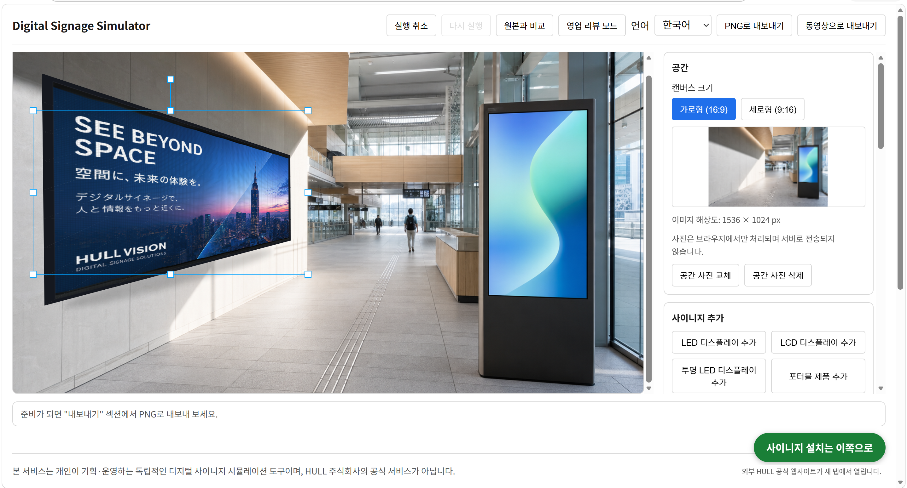
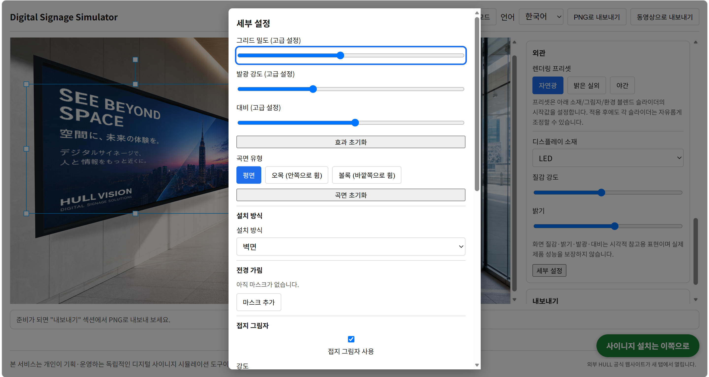

# Digital Signage Simulator

> 공간 사진 위에 디지털 사이니지를 설치한 모습을 빠르게 시뮬레이션하고,  
> 영업·제안용 이미지로 내보낼 수 있는 브라우저 기반 디지털 사이니지 시뮬레이터

**[Live Demo](https://digitalsignage-simulater.onrender.com)** ·
**[Issues](https://github.com/sehyun2727/Digitalsignage-Simulater/issues)**

> **Independent personal project. Not an official HULL service.**  
> HULL株式会社 인턴십 경험에서 출발한 개인 프로젝트입니다.



---

## From Sales Floor to Working Software

일본 **HULL株式会社** 인턴십 중 디지털 사이니지 영업 현장에 동행하며, 고객에게 제품의 장점만 설명하는 것보다 **“이 공간에 설치하면 실제로 어떻게 보이는가”를 빠르게 보여주는 것**이 중요하다는 점을 관찰했습니다.

영업 자료를 준비하는 과정에서는 고객 공간 사진 위에 제품을 배치하고, 콘텐츠를 넣고, 설치 후 모습을 설명하기 위한 시안을 반복해서 만들어야 했습니다. 하지만 이미지 편집 도구만으로는 매번 위치·크기·원근·콘텐츠를 조절해야 했고, 제안 전 준비에도 시간이 필요했습니다.

이 반복 작업을 줄이고, 설치 전후 모습을 더 직관적으로 보여줄 수 있도록 만든 도구가 **Digital Signage Simulator**입니다.

```text
공간 사진 업로드
      ↓
디지털 사이니지 배치
      ↓
이미지 / 영상 콘텐츠 적용
      ↓
원근·재질·조명 보정
      ↓
제안 이미지 내보내기
```

인턴십 기간 중 결과물을 공유하며, **영업 시안 제작과 설치 후 모습을 설명하는 과정에서 활용 가능성이 있다**는 피드백을 받았습니다.

이 프로젝트는 단순한 이미지 편집기가 아니라, 현장에서 관찰한 반복 업무를 **브라우저에서 바로 사용할 수 있는 도구로 전환해 본 개인 프로젝트**입니다.

---

## Key Features

### 1. Perspective Placement

실제 공간 사진 위에 사이니지를 배치하고 설치면에 맞게 원근을 조정할 수 있습니다.

- 4점 원근 배치
- 위치 / 크기 / 회전 조절
- 화면 영역 및 콘텐츠 위치 조정
- 벽면·쇼윈도 등 설치면에 맞춘 배치

### 2. Scene Integration

단순히 이미지를 겹치는 것을 넘어 주변 환경과 자연스럽게 섞이도록 합성 요소를 제공합니다.

- 밝기 조절
- LED glow
- 그림자
- 반사
- 투명도
- 환경색 적응
- 오클루전 마스크
- 곡률 표현

### 3. Multiple Signage Types

다양한 설치 형태를 기준으로 시뮬레이션할 수 있습니다.

| 유형 | 활용 예시 |
| --- | --- |
| Wall LED | 매장 외벽, 건물 벽면, 대형 홍보 화면 |
| LCD Display | 실내 메뉴판, 안내 화면, 로비 디스플레이 |
| Transparent LED | 쇼윈도, 유리면 광고 |
| Stand Display | 행사장, 매장 입구, 안내 디스플레이 |
| Custom Portable Product | 실제 제품 이미지를 활용한 포터블 제품 시안 |

### 4. Image / Video Content

사이니지 화면에 실제 콘텐츠를 적용해 설치 후 모습을 미리 확인할 수 있습니다.

- 이미지 콘텐츠
- 영상 콘텐츠
- 콘텐츠 드래그 / 크기 조절
- 화면 내 콘텐츠 위치 조정

### 5. Advanced Composition Controls

기본 편집 흐름을 방해하지 않도록 세부 합성 기능은 고급 설정 영역에서 조절할 수 있습니다.



- Brightness
- Glow
- Shadow
- Reflection
- Opacity
- Curvature
- Environment blending
- Occlusion mask
- Material / installation presets

### 6. Export

완성된 시안을 영업·제안 자료로 바로 활용할 수 있도록 내보낼 수 있습니다.

- PNG 이미지 내보내기
- 브라우저 지원 환경에서 WebM 영상 내보내기
- 원본 캔버스 해상도 기반 출력

---

## Core Workflow

### 1. 공간 사진 업로드

매장, 로비, 외벽, 쇼윈도 등 설치를 검토할 공간 사진을 업로드합니다.

- `JPG`
- `PNG`
- `WebP`

### 2. 사이니지 추가

공간에 맞는 디스플레이 유형을 선택해 추가합니다.

### 3. 콘텐츠 적용

사이니지 화면에 이미지 또는 영상을 적용합니다.

### 4. 설치 환경에 맞게 조정

위치와 크기를 조절하고 필요에 따라 원근, 그림자, 반사, glow, 환경색 등을 보정합니다.

### 5. 결과물 저장

완성된 시안을 PNG 또는 브라우저가 지원하는 경우 WebM으로 내보냅니다.

---

## Sales-oriented Editing Flow

처음 사용하는 사람도 아래의 기본 흐름만 따라가면 시안을 만들 수 있도록 구성했습니다.

```text
1. 공간 사진 업로드
2. 사이니지 추가
3. 콘텐츠 적용
4. PNG 저장
```

세부 합성 옵션은 기본 작업 흐름을 방해하지 않도록 고급 설정 영역으로 분리했습니다.

---

## Technical Highlights

이 프로젝트에서 핵심적으로 다룬 기술적 문제는 단순한 UI 구현보다 **2D 이미지 위에 실제 공간의 설치감을 표현하는 것**이었습니다.

### Rendering / Composition

- React + TypeScript 기반 editor
- React Konva / Konva canvas composition
- 4-point perspective transformation
- Shadow / reflection / glow 처리
- 환경색 샘플링 및 블렌딩
- Curvature 표현
- Occlusion mask
- Image / video compositing
- PNG / WebM export

### State Management

- Zustand 기반 editor/document state
- Undo / Redo
- 콘텐츠 / 사이니지 / 레이어 상태 관리

### Quality

- Vitest unit tests
- React Testing Library
- Playwright E2E tests
- Export 결과 검증
- Visual QA scenarios
- GitHub Actions CI

---

## Tech Stack

### Frontend

- **React**
- **TypeScript**
- **Vite**
- **React Konva / Konva**
- **Zustand**

### Testing & Quality

- **Vitest**
- **React Testing Library**
- **Playwright**
- GitHub Actions CI
- Visual QA

### Deployment

- Docker multi-stage build
- Nginx
- Render Static Site

---

## Architecture

```text
src/
├── features/
│   └── editor/             # 편집기 UI, 캔버스, 툴바, 고급 설정
├── store/                  # Zustand document / editor state
├── lib/                    # 렌더링, 파일 검증, export, asset 관리 유틸리티
├── types/                  # TypeScript domain types
├── i18n/                   # ja / ko / en locale resources
├── styles/                 # global styles
└── components/             # 공통 UI 컴포넌트

e2e/
├── fixtures/               # E2E / visual QA fixture
├── support/                # Playwright helper
└── *.spec.ts               # Editor, export, mobile, visual QA tests

tests/
└── unit/                   # Unit / component tests

docs/
├── quality-runbook.md      # QA 실행 가이드
└── runbooks/               # Render 배포 관련 문서
```

---

## Privacy

사용자가 업로드한 공간 사진과 콘텐츠는 기본적으로 **브라우저 내부에서 처리**됩니다.

- 별도 회원가입 없음
- 별도 프로젝트 서버 저장 없음
- 기본적인 작업 데이터의 서버 업로드 없이 브라우저 중심으로 처리
- 워터마크 없음

브라우저를 새로고침하거나 세션이 종료되면 작업 내용이 사라질 수 있으므로, 필요한 결과물은 PNG로 저장하는 것을 권장합니다.

---

## Supported Files

| 구분 | 지원 형식 | 기본 제한 |
| --- | --- | --- |
| 공간 사진 | JPG, PNG, WebP | 최대 10MB |
| 콘텐츠 이미지 | JPG, PNG, WebP | 최대 10MB |
| 콘텐츠 영상 | MP4, WebM | 최대 80MB |

> 브라우저와 파일 코덱에 따라 일부 영상은 불러오지 못할 수 있습니다.

---

## Browser Support

### Recommended

- Latest Chrome
- Latest Microsoft Edge
- Latest Safari
- iOS Safari
- Android Chrome

### Export Notes

| 기능 | 지원 범위 |
| --- | --- |
| PNG 내보내기 | 주요 최신 브라우저 지원 |
| WebM 내보내기 | Chrome / Edge 권장 |
| 영상 콘텐츠 | 브라우저의 지원 코덱에 따라 달라질 수 있음 |

---

## Local Development

### Requirements

- Node.js `22.x`
- npm

### Install

```bash
git clone https://github.com/sehyun2727/Digitalsignage-Simulater.git
cd Digitalsignage-Simulater
npm ci
```

### Run Development Server

```bash
npm run dev
```

### Production Build

```bash
npm run build
npm run preview
```

---

## Quality Checks

```bash
# Formatting
npm run format:check

# Lint
npm run lint

# TypeScript check
npm run typecheck

# Unit tests
npm test

# Production build
npm run build

# Playwright E2E tests
npm run test:e2e
```

Visual QA 관련 절차는 [`docs/quality-runbook.md`](./docs/quality-runbook.md)를 참고하세요.

---

## Deployment

프로젝트는 Render Static Site 배포를 기준으로 구성했습니다.

- Vite production build
- Docker multi-stage build
- Nginx static serving
- SPA fallback
- GitHub Actions quality gate

배포 전 점검 절차는 [`docs/runbooks/render-static-site.md`](./docs/runbooks/render-static-site.md)를 참고하세요.

---

## Project Background

이 프로젝트는 HULL株式会社 인턴십 기간 중 진행한 **독립 개인 프로젝트**입니다.

- **Role:** Planning, UX direction, frontend development, testing, deployment
- **Context:** Digital signage sales 동행 및 현장 관찰
- **Problem:** 설치 후 모습을 전달하기 위한 시안 제작의 반복 작업
- **Solution:** 공간 사진 기반의 브라우저 디지털 사이니지 시뮬레이터
- **Outcome:** 영업 자료에서 before / after를 더 직관적으로 보여주기 위한 활용 가능성 확인

인턴십 전체 기록은 아래 포트폴리오에서 확인할 수 있습니다.

- [Internship Portfolio — From Code to Business](https://jisa-internship-reflection.onrender.com)

---

## Roadmap

### V1 — Completed

- [x] 브라우저 기반 사이니지 시뮬레이터
- [x] 이미지·영상 콘텐츠 적용
- [x] LED / LCD / 투과 LED / 포터블 제품
- [x] 원근·그림자·반사·환경 적응
- [x] PNG / WebM 내보내기
- [x] 일본어 / 한국어 / 영어
- [x] Unit / E2E / Visual QA
- [x] Render 배포

### V2 — Planned

- [ ] 더 빠른 영업 시안 제작 플로우
- [ ] 제품·공간·업종 중심 프리셋
- [ ] 빠른 시안 모드와 정밀 편집 모드 분리
- [ ] 고객용 전 / 후 비교 프리뷰
- [ ] 제품 카탈로그 및 설치 목적 기반 추천
- [ ] 공유 링크 및 제안서 출력 검토
- [ ] 모바일 UX 개선

---

## Known Limitations

- 실제 설치 공간의 조명, 반사, 재질을 완전히 재현하지는 않습니다.
- 결과물은 영업·기획 단계의 시각 시뮬레이션을 위한 것입니다.
- 실제 설치 전에는 제품 규격, 밝기, 전력, 구조 안전성, 설치 환경을 별도로 검토해야 합니다.
- 영상 내보내기는 브라우저 기능 지원 여부에 따라 제한될 수 있습니다.
- 현재는 브라우저 세션 중심으로 동작하며, 프로젝트 클라우드 저장 기능은 제공하지 않습니다.

---

## License

This project is an independent portfolio project.

Repository code and assets are provided for portfolio and educational reference.  
For commercial use, redistribution, or reuse of project assets, please contact the author.

---

## Author

**Sung Sehyun**

- GitHub: [@sehyun2727](https://github.com/sehyun2727)
- Portfolio: [jisa-internship-reflection.onrender.com](https://jisa-internship-reflection.onrender.com)
